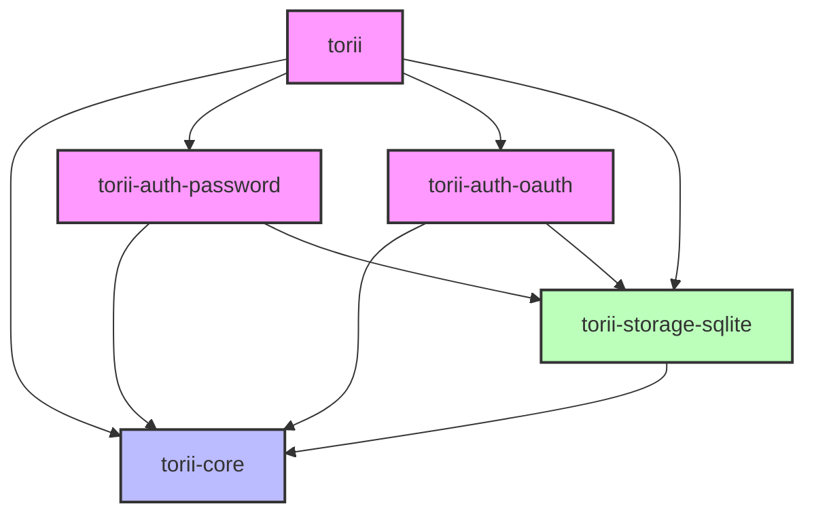

# Contributing to Torii

Thank you for considering contributing to Torii! This document outlines the process for contributing to the project and our expectations for contributions.

## Code of Conduct

Contributors are expected to maintain a respectful and inclusive environment. Be considerate of differing viewpoints and experiences, and focus on constructive feedback and collaboration.

## Getting Started

1. Fork the repository
2. Clone your fork: `git clone https://github.com/your-username/torii-rs.git`
3. Create a branch for your feature or fix: `git checkout -b your-feature-name`
4. Make your changes following our code style.
5. Run tests and linting: `make check` and `make fmt`
6. Submit a pull request

## AI/LLM Usage Policy

We allow and encourage AI-assisted contributions, but we maintain high standards for code quality:

- **Allowed AI/LLM usage**:
  - Code generation assistance
  - Documentation writing
  - Test case generation
  - Refactoring suggestions
  - Debugging help

- **Guidelines for AI-assisted contributions**:
  - Review and understand all AI-generated code before submitting
  - Test all AI-generated code thoroughly
  - Ensure AI-generated code follows our code style and architecture
  - Properly attribute AI assistance in commit messages
  - Be prepared to explain and defend any AI-assisted code

- **What we consider "AI slop" (not acceptable)**:
  - Blindly pasting AI-generated code without review
  - Code that doesn't follow project conventions
  - Poorly tested or buggy AI-generated solutions
  - Unnecessary or overly complex implementations
  - Boilerplate comments or unhelpful documentation
  - Solutions that don't actually solve the problem

All contributions, whether AI-assisted or not, are subject to the same quality standards and review process.

## Torii Architecture

